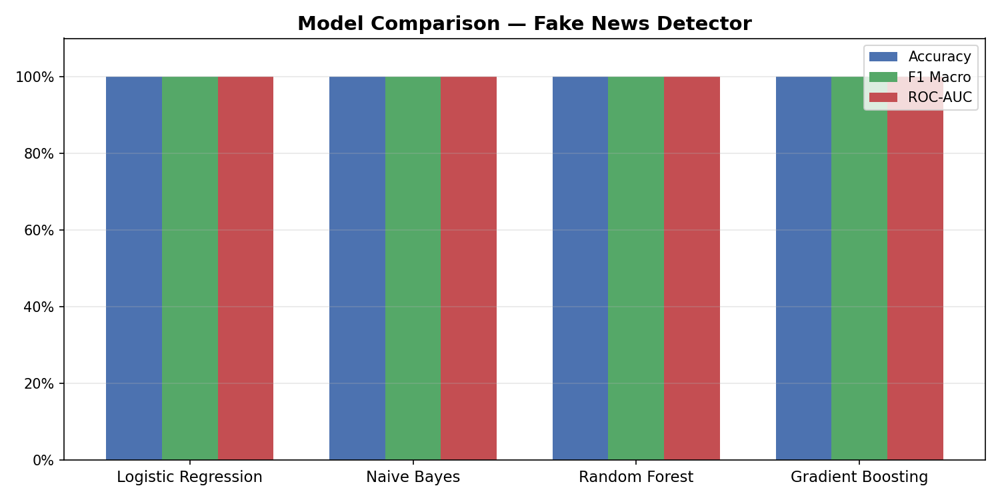
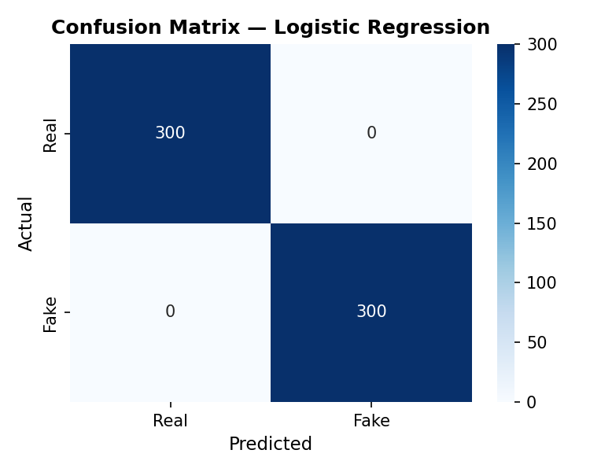
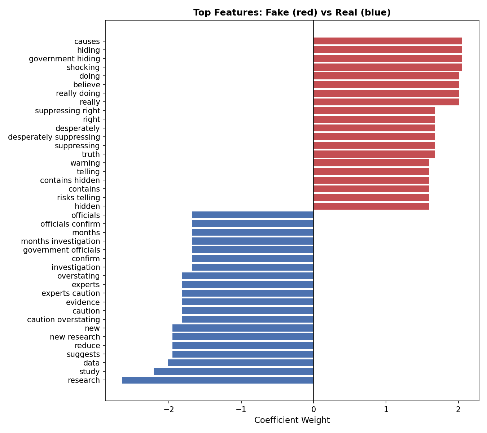

# Fake News Detector

A Python project that uses machine learning to classify news text as real or fake. Built as part of my interest in NLP and AI — I wanted to see how well traditional ML models could detect misinformation patterns in text.

## What it does

Trains and compares four classifiers (Logistic Regression, Naive Bayes, Random Forest, Gradient Boosting) on TF-IDF text features, picks the best one by F1 score, and lets you run predictions on any text you give it.

| Model | Selection metric |
|---|---|
| Logistic Regression | Macro F1 |
| Naive Bayes | Macro F1 |
| Random Forest | Macro F1 |
| Gradient Boosting | Macro F1 |

## Project Structure

```
fake_news_detector/
├── main.py                  # Run this — handles training, evaluation, demo
├── src/
│   ├── classifier.py        # FakeNewsClassifier class — core ML logic
│   ├── generate_data.py     # Synthetic dataset (swap for real data)
│   └── visualize.py         # Evaluation plots
├── data/
│   └── news.csv             # Auto-generated dataset
├── results/
│   ├── model_comparison.png
│   ├── confusion_matrix.png
│   └── top_features.png
├── requirements.txt
└── README.md
```

## Setup

```bash
git clone https://github.com/YOUR_USERNAME/fake-news-detector.git
cd fake-news-detector
pip install -r requirements.txt
```

## Usage

```bash
# Train all models and evaluate
python main.py

# Predict on your own text
python main.py --predict "Scientists confirm new vaccine reduces risk by 40%"
```

## Sample Output

```
[best]  Logistic Regression (F1=0.964)

🟢 REAL  (97.2% confidence)
   "Scientists from Oxford publish peer-reviewed study..."

🔴 FAKE  (98.8% confidence)
   "SHOCKING: Government is secretly putting mind control chemicals..."
```

## How it works

1. Text is converted to numerical features using **TF-IDF** with bigrams — this captures phrases like "peer reviewed" or "they don't want" rather than just single words.
2. An 80/20 **stratified split** keeps fake/real ratio equal in both train and test sets.
3. All four models are wrapped in **sklearn Pipelines** so the vectorizer and classifier stay together — this avoids data leakage.
4. **Macro F1** is used instead of accuracy because accuracy can be misleading — a model that always guesses "real" could still score 50% accuracy on a balanced dataset.
5. Best model is saved with **pickle** so you can run predictions without retraining every time.

## Using a real dataset

Replace `data/news.csv` with any CSV that has `text` and `label` columns (0 = real, 1 = fake).

Two good ones:
- [LIAR dataset](https://huggingface.co/datasets/liar) — 12K labelled political statements
- [FakeNewsNet](https://github.com/KaiDMML/FakeNewsNet) — GossipCop + PolitiFact

## Results





## What I want to add next

- [ ] Plug in the LIAR dataset instead of synthetic data
- [ ] Simple Streamlit web interface
- [ ] Try sentence-transformers for richer text embeddings
- [ ] Add cross-validation to the evaluation

## Requirements

```
pandas
numpy
scikit-learn
matplotlib
seaborn
```
